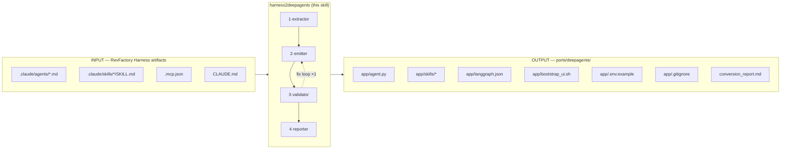
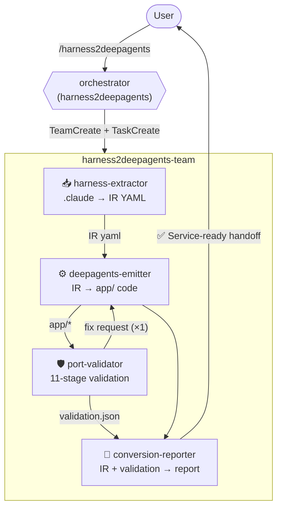
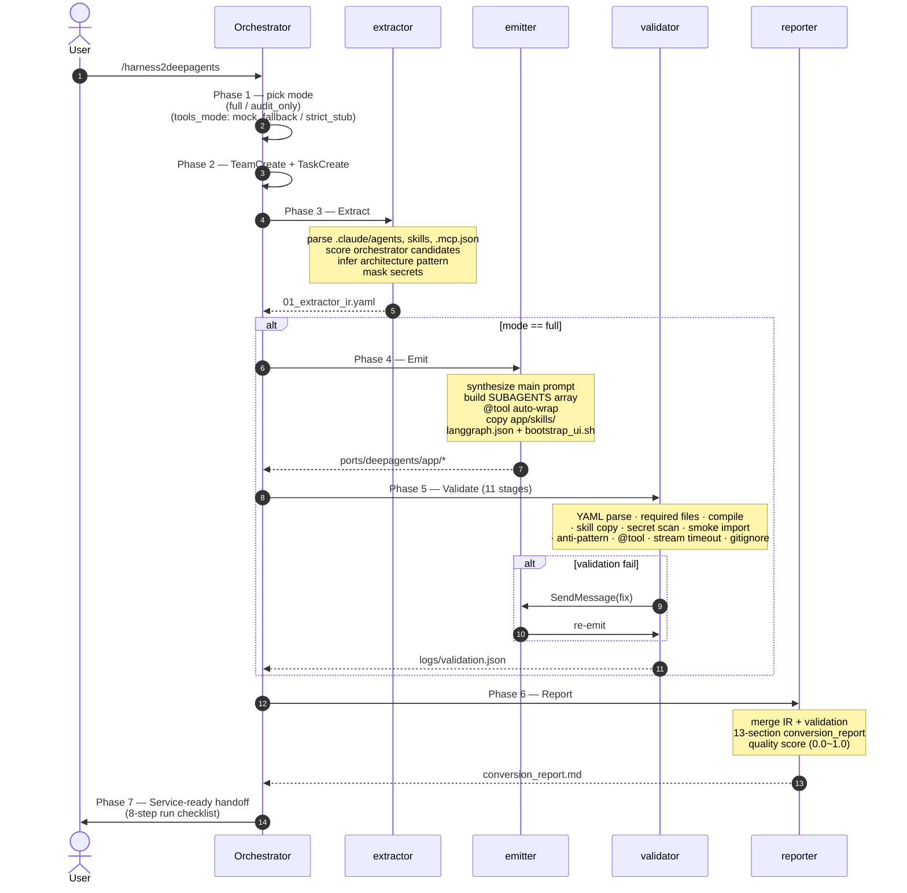
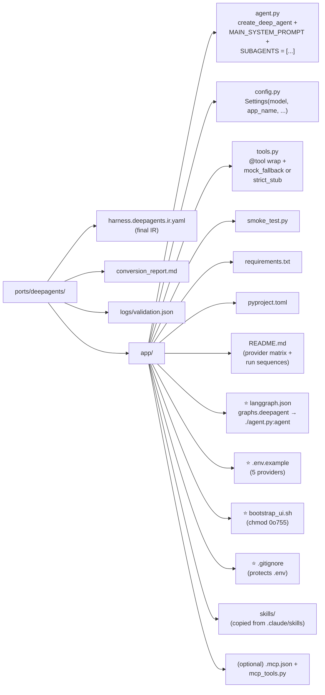
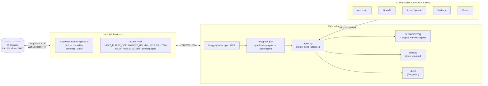
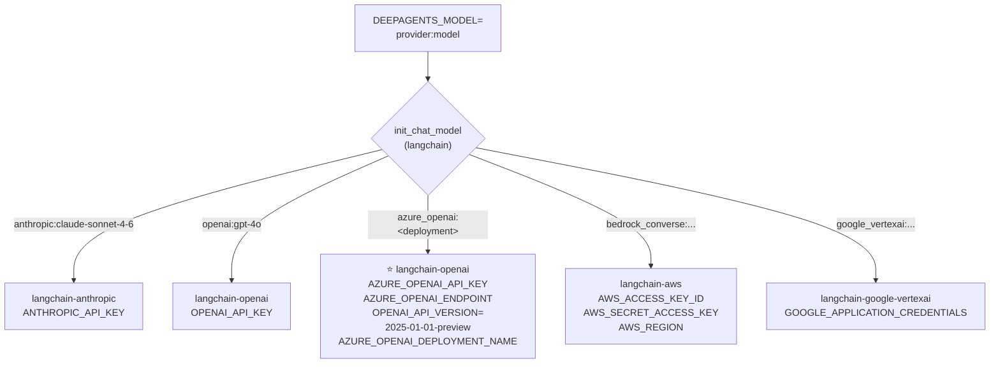
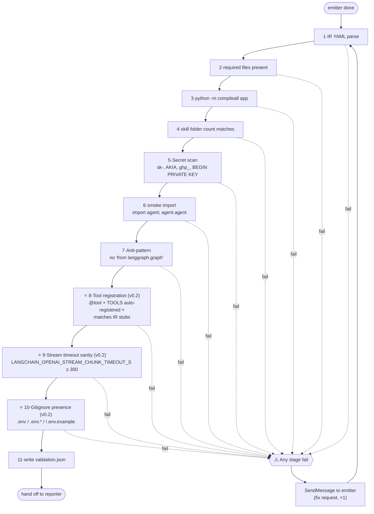
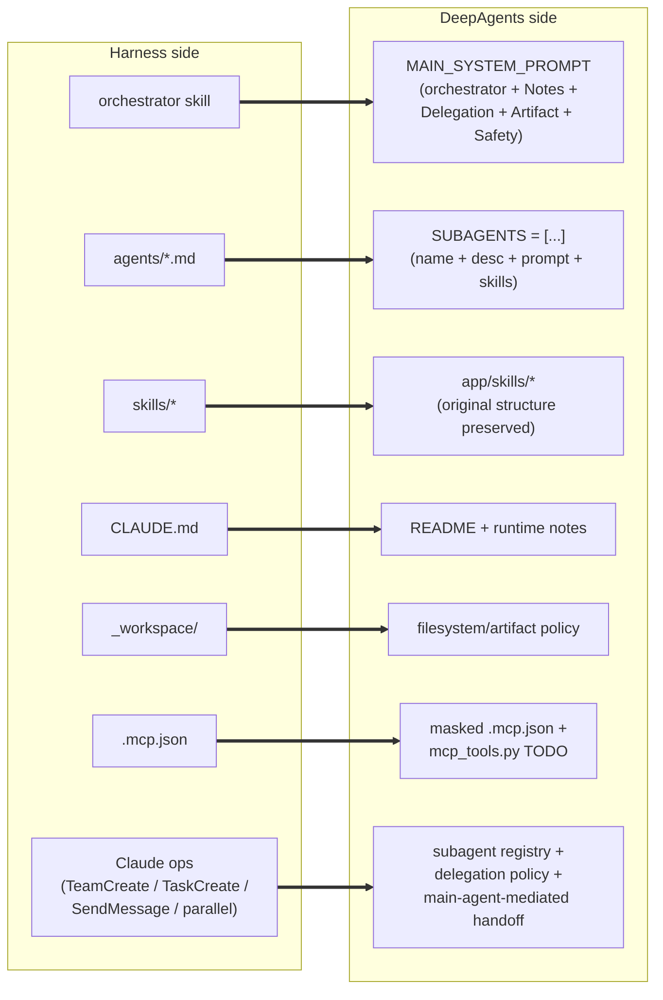
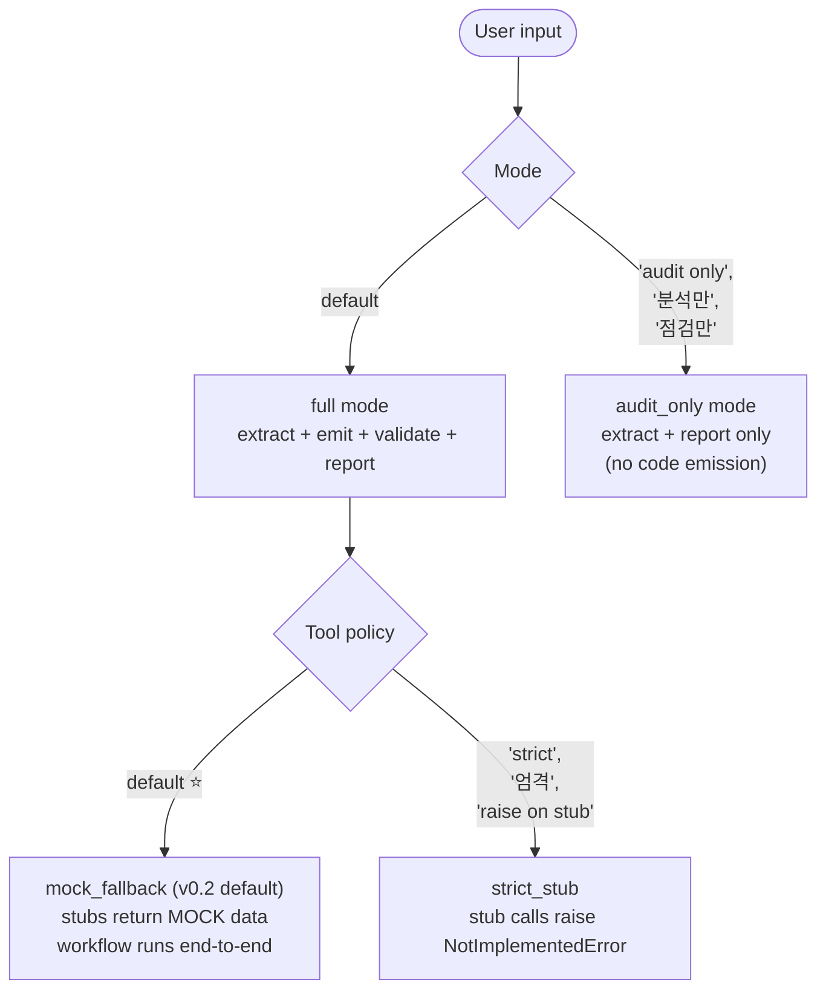

<p align="right"><sub><b>🇬🇧 English</b> · <a href="README_ko.md">🇰🇷 한국어</a></sub></p>

# harness2deepagents

**A Claude Code skill that auto-converts Claude Code agent teams built with RevFactory `/harness` into runnable LangChain DeepAgents Python apps.**

`/harness` owns the strength of "declarative agent team design"; `harness2deepagents` takes that output and turns it into **a Python package you can boot immediately with `langgraph dev`, complete with the default UI (`langchain-ai/deep-agents-ui`) already wired up**.

- **Version:** v0.2.0
- **Source format:** `.claude/agents/*.md`, `.claude/skills/*/SKILL.md`, `.mcp.json`, `CLAUDE.md`
- **Target:** Python app built around `from deepagents import create_deep_agent`
- **Default UI:** [`langchain-ai/deep-agents-ui`](https://github.com/langchain-ai/deep-agents-ui) (auto-wired)
- **Forbidden:** raw LangGraph emitter, single `create_agent` apps, hard-coded secrets

---

## At a glance



---

## When to use it

| Trigger | Behavior |
|---|---|
| `/harness2deepagents` | Find `.claude/` in the current directory and convert it into `ports/deepagents/` (full mode) |
| `/harness2deepagents audit only` | Produce only IR + `conversion_report` — no code emission |
| `/h2d` | Alias for full mode |
| "Convert this .claude to DeepAgents" / "Migrate this harness" / "Port my Claude Code team to LangChain" | Natural-language triggers |

When **not** to use it:

- "Build me a harness" → use `/harness` (this skill converts, it does not author)
- "Build a LangGraph graph for me" → out of scope (raw LangGraph is intentionally rejected)
- "How do I install the deepagents library" → generic question

---

## The 4-agent team

`harness2deepagents` is not a monolithic converter — it's a 4-agent team running a **Pipeline + Producer-Reviewer** pattern.



| # | Member | Input | Output | Responsibility |
|---|--------|-------|--------|----------------|
| 1 | **harness-extractor** | `.claude/*`, `.mcp.json`, `CLAUDE.md` | `_workspace/01_extractor_ir.yaml` | Parsing + pattern inference + secret masking |
| 2 | **deepagents-emitter** | IR YAML | `output_dir/app/*` (12 files) | Deterministic codegen, `@tool` wrapping, UI wiring |
| 3 | **port-validator** | `output_dir/app/*` | `logs/validation.json` | compile / secret / smoke / anti-pattern checks (11 stages) |
| 4 | **conversion-reporter** | IR + validation.json | `conversion_report.md` + quality score | Service-ready handoff checklist |

In `audit_only` mode only extractor + reporter run, and code emission is blocked.

---

## Conversion workflow (7 phases)



---

## Generated app layout



⭐ marked items are **shipped by default from v0.2**, so users can launch deep-agents-ui with zero extra wiring.

---

## Default UI runtime topology



**Run sequence (the generated app's README walks you through this):**

```bash
cd ports/deepagents/app
python3 -m venv .venv && source .venv/bin/activate
pip install -r requirements.txt
cp .env.example .env             # uncomment a provider block + fill in keys
set -a; source .env; set +a
python smoke_test.py             # import sanity check

# Terminal A — backend
langgraph dev --port 2024 --no-browser
# → check http://127.0.0.1:2024/ok

# Terminal B — UI (bootstrap only once)
bash bootstrap_ui.sh
cd ui && yarn install            # Node 20+ recommended
yarn dev                         # http://localhost:3000
```

---

## Provider matrix (provider-agnostic)

`DEEPAGENTS_MODEL` follows LangChain's `init_chat_model` format. **Any provider works with zero code changes** — just edit `.env`.



| Provider | `DEEPAGENTS_MODEL` example | Required env | Extra install |
|---|---|---|---|
| **Anthropic** (default) | `anthropic:claude-sonnet-4-6` | `ANTHROPIC_API_KEY` | — (already bundled) |
| **OpenAI** | `openai:gpt-4o` | `OPENAI_API_KEY` | — (already bundled) |
| **Azure OpenAI** | `azure_openai:<deployment-name>` | `AZURE_OPENAI_API_KEY`, `AZURE_OPENAI_ENDPOINT`, `OPENAI_API_VERSION=2025-01-01-preview`, `AZURE_OPENAI_DEPLOYMENT_NAME` | — (already bundled) |
| **AWS Bedrock** | `bedrock_converse:anthropic.claude-3-5-sonnet-...` | AWS keys + region | `pip install langchain-aws` |
| **Google Vertex** | `google_vertexai:gemini-1.5-pro` | GCP credentials | `pip install langchain-google-vertexai` |

> **Azure caveat:** `azure_openai:<deployment>` uses the **Azure deployment name**, not the OpenAI model id. GPT-5.x deployments require `OPENAI_API_VERSION=2025-01-01-preview` or newer.
>
> **Reasoning-model caveat** (gpt-5.x / o3 / claude-opus-extended-thinking): without `LANGCHAIN_OPENAI_STREAM_CHUNK_TIMEOUT_S=600`, runs abort with `StreamChunkTimeoutError`. The generated `.env.example` includes this by default.

---

## Validator 11-stage pipeline (v0.2)

`port-validator` checks the emitter's output across 11 stages. Any failure triggers one fix request to the emitter.



⭐ (stages 8/9/10) are **new in v0.2** — regression guards added after seeing v0.1 output break in real-world operation.

---

## Mapping rules (Harness → DeepAgents)



| Harness | DeepAgents | Lossiness |
|---|---|---|
| `.claude/agents/*.md` body | subagent `system_prompt` (preserved as raw string) | Low |
| agent name / description | subagent `name` / `description` | Low |
| `.claude/skills/*/` whole tree | `app/skills/*/` (copied verbatim) | Low |
| `TeamCreate` | `SUBAGENTS` registry | Low |
| `TaskCreate` | main agent planning instruction | Medium |
| `SendMessage` | main-agent-mediated handoff | Medium |
| Peer-to-peer team chat | (cannot be expressed directly) | **High** |
| `Agent(..., run_in_background=true)` | parallel delegation instruction or TODO | Medium |

**Principle:** preserve the 4-axis separation of Who(agent) / How(skill) / When(orchestration) / What left(artifact). **No prompt flattening** — never merge several agent bodies into one main prompt.

---

## Mode matrix



**Why is `mock_fallback` the v0.2 default?** v0.1 shipped `raise NotImplementedError` + `TOOLS = []` by default, so the first tool call killed the workflow. That made demos, CI runs, and offline use impossible.

Even in mock mode, the emitter embeds **one or two reference implementations** (Z.AI / Tavily / FAL / httpx, etc.) as comments in each stub's docstring, so going from mock to real never starts from zero.

---

## Quick Start

### 1. Run it from a directory that has Harness artifacts

```bash
cd /path/to/your/harness-project   # has .claude/agents, .claude/skills
# In Claude Code:
/harness2deepagents
```

### 2. After conversion (~tens of seconds) you'll see

```
✅ DeepAgents app conversion complete
- output: ports/deepagents/
- conversion score: 0.92/1.00
- manual actions: 3
- tools_mode: mock_fallback

📋 Service-ready checklist:
1. cd ports/deepagents/app
2. python3 -m venv .venv && source .venv/bin/activate
3. pip install -r requirements.txt
4. cp .env.example .env  # fill in provider keys
5. set -a; source .env; set +a
6. python smoke_test.py
7. langgraph dev --port 2024 --no-browser
8. (optional) bash bootstrap_ui.sh && cd ui && yarn install && yarn dev
```

The checklist works as-is (thanks to the v0.2 regression guards).

### 3. Audit-only — just check convertibility

```bash
/harness2deepagents audit only
```

→ Produces only `_workspace/01_extractor_ir.yaml` + `conversion_report.md`. No code emitted.

---

## v0.2.0 operational pitfall catalogue

Pitfalls discovered while actually running v0.1 output all the way to a LangGraph backend + deep-agents-ui frontend. v0.2's emitter/validator now block all of these **at codegen time**.

| # | Symptom | v0.1 cause | v0.2 auto-prevention |
|---|---|---|---|
| F1 | First tool call hits `NotImplementedError` → workflow dies | stub `raise` + `TOOLS = []` | **mock_fallback default** + `TOOLS` auto-registered |
| F2 | LLM doesn't even know the tool exists | plain function (no args schema exposed) | **`@tool` decorator mandatory** (Stage 8 check) |
| F3 | Risk of committing `.env` | no `.gitignore` | **`app/.gitignore` auto-generated** (Stage 10 check) |
| F4 | `StreamChunkTimeoutError: 583 chunks then 120s silence` | langchain-openai default 120s is too short for reasoning models | `.env.example` includes **`LANGCHAIN_OPENAI_STREAM_CHUNK_TIMEOUT_S=600`** (Stage 9 check) |
| F5 | Azure GPT-5.x deployment doesn't respond | `OPENAI_API_VERSION=2024-10-21` is too old | Provider notes recommend **`2025-01-01-preview`** |
| F6 | Launching the UI is non-obvious (yarn install + Node 20) | README mentioned only `bash bootstrap_ui.sh` | README now has the **exact 3-command sequence** + Node version |
| F7 | Default `recursion_limit=25` runs out fast | DeepAgents plan/todo nodes consume cycles | README recommends **`recursion_limit=50`** |
| F8 | Confusion over where to run `langgraph dev` | langgraph.json location unclear | README spells out **`cd app && langgraph dev`** |
| F9 | `.env` vars don't take effect | `source .env` missing | README spells out **`set -a; source .env; set +a`** |
| F10 | `from langchain_core.tools import tool` import missing | langchain-core absent from requirements.txt | **Added to the minimum requirements** |

These were treated as **emitter/validator defects**, not mere documentation gaps. From v0.2 onward, every new build prevents them at codegen time.

---

## Error handling

```mermaid
flowchart TB

    Start([conversion start])
    Check{".claude/agents or<br/>.claude/skills present?"}
    NoSrc[["❌ exit immediately<br/>'no RevFactory Harness artifacts'<br/>no files created"]]
    ExtErr{extractor partial<br/>parse failure?}
    ExtWarn["proceed with available IR +<br/>log warnings"]
    EmitErr{emitter stage fail?}
    EmitRetry["1 retry"]
    EmitPartial["keep partial output +<br/>flag to reporter"]
    ValErr{validator fail<br/>(compile/secret)?}
    ValFix["fix request to<br/>emitter (×1)"]
    ValStill{still failing?}
    ValPartial["report it"]
    Done([reporter → User])

    Start --> Check
    Check -->|"no"| NoSrc
    Check -->|"yes"| ExtErr
    ExtErr -->|"yes"| ExtWarn
    ExtErr -->|"no"| EmitErr
    ExtWarn --> EmitErr
    EmitErr -->|"yes"| EmitRetry
    EmitErr -->|"no"| ValErr
    EmitRetry --> EmitPartial
    EmitPartial --> ValErr
    ValErr -->|"yes"| ValFix
    ValErr -->|"no"| Done
    ValFix --> ValStill
    ValStill -->|"yes"| ValPartial
    ValStill -->|"no"| Done
    ValPartial --> Done
```

| Situation | Strategy |
|---|---|
| No `.claude/` artifacts found | Exit immediately with a clear message, no files written |
| Partial extractor parse failure | Proceed with available IR + log warnings |
| Emitter stage failure | Retry once; if still failing, keep partial output |
| Validator fail | One fix request to emitter → re-validate → if still failing, reporter flags it |
| `ports/deepagents/` already exists | Create `ports/deepagents_YYYYMMDD_HHMMSS/` instead (never overwrite) |
| `audit_only` tries to trigger emit | Orchestrator blocks it |
| Team member stalls | Leader detects and restarts; if it still fails, reporter runs on partial results |

---

## Invariant safety rules

- 🔒 **Original `.claude/` is read-only** — never modified
- 🔒 **Output path stays inside the project root** — path-traversal blocked
- 🔒 **Secret masking** — `sk-...`, `AKIA...`, `ghp_...`, `BEGIN PRIVATE KEY` patterns are never exposed in IR / code / report
- 🔒 **No external API calls** — live invocation is forbidden (smoke_test only imports)
- 🔒 **No auto-launching of MCP servers** — `mcp_tools.py` is a TODO stub only
- 🔒 **No raw-LangGraph emitter** — blocked by Stage 7 anti-pattern check
- 🔒 **`.env` commits blocked** — emit auto-generates `.gitignore`

---

## Directory layout (this skill itself)

```
~/.claude/skills/harness2deepagents/
├── SKILL.md                       # orchestrator (the skill's entry point)
├── README.md                      # ← this file (English, default)
├── README_ko.md                   # Korean version
└── references/
    ├── ir-schema-summary.md       # IR YAML schema summary
    ├── mapping-rules.md           # Harness ops → DeepAgents mapping
    ├── usage-examples.md          # invocation examples + trigger patterns
    └── edge-cases.md              # EC-001 ~ EC-010

# Sister skills in the same working tree
~/.claude/skills/
├── harness-source-extraction/     # used by extractor (.claude → IR)
├── deepagents-emission/           # used by emitter (IR → app/)
│   ├── SKILL.md
│   ├── assets/                    # 11 *.tmpl codegen templates
│   ├── scripts/emit_deepagents.py # deterministic codegen engine
│   └── references/
│       ├── codegen-templates.md
│       ├── prompt-synthesis.md
│       ├── mcp-handling.md
│       └── tool-adapters.md       # v0.2 — provider-specific reference impls
├── port-validation/               # used by validator (11 stages)
└── conversion-reporting/          # used by reporter

# Agents in the same working tree
~/.claude/agents/
├── harness-extractor.md
├── deepagents-emitter.md
├── port-validator.md
└── conversion-reporter.md
```

---

## Further reading

| Doc | Contents |
|---|---|
| `SKILL.md` | orchestrator / 7-phase workflow / operational pitfall catalogue |
| `references/ir-schema-summary.md` | `harness.deepagents.ir.yaml` schema (PRD §12.2) |
| `references/mapping-rules.md` | Harness ↔ DeepAgents mapping rules (PRD §16) |
| `references/usage-examples.md` | trigger keywords / invocation patterns / run sequences |
| `references/edge-cases.md` | EC-001 ~ EC-010 |
| `../deepagents-emission/SKILL.md` | 9-step emit procedure / template variables |
| `../deepagents-emission/references/tool-adapters.md` | web_search / fetch_url / image_gen — Z.AI / Tavily / FAL implementations |
| `../port-validation/SKILL.md` | 11-stage validation procedure |
| `../conversion-reporting/SKILL.md` | 13-section report structure + quality-score weights |

---

## In one line

> **`/harness` designs the agent team; `/harness2deepagents` turns it into a runnable LangChain DeepAgents app — UI included, provider-agnostic, operational pitfalls auto-prevented.**
