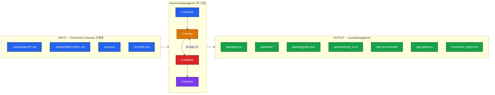
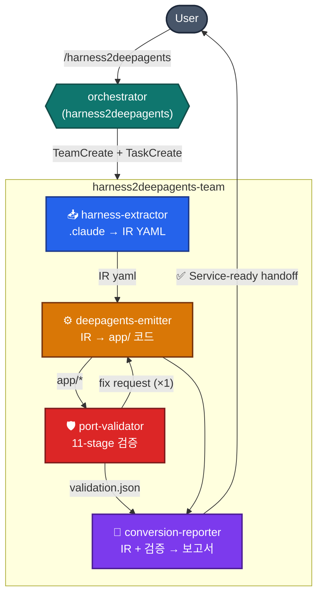
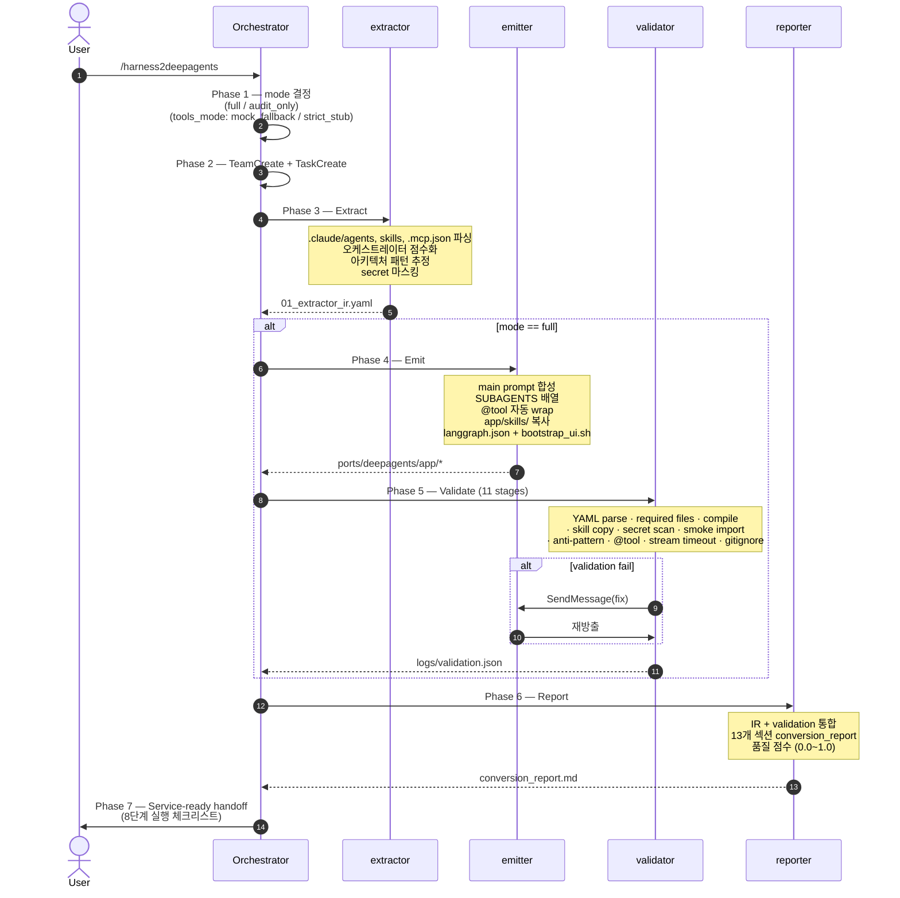
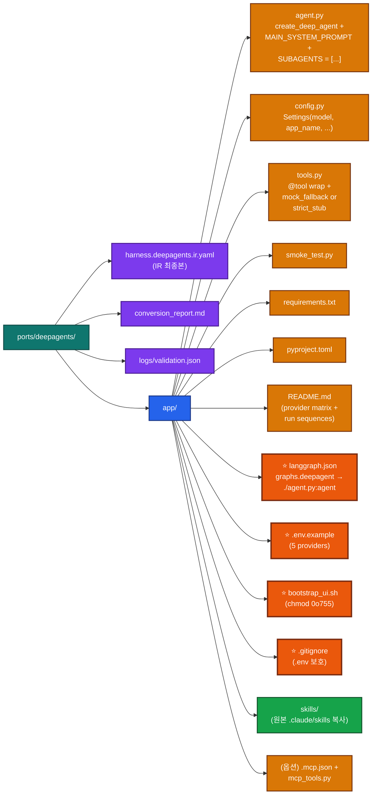
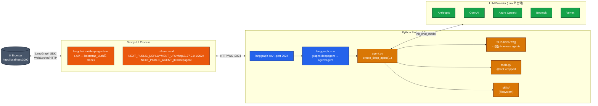
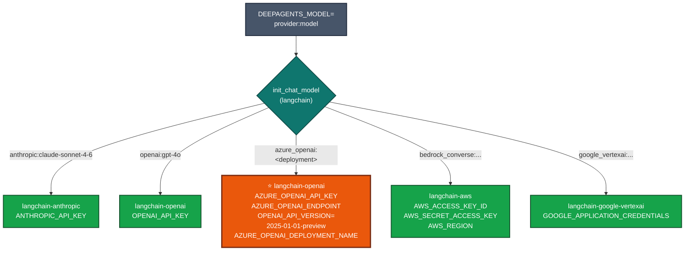
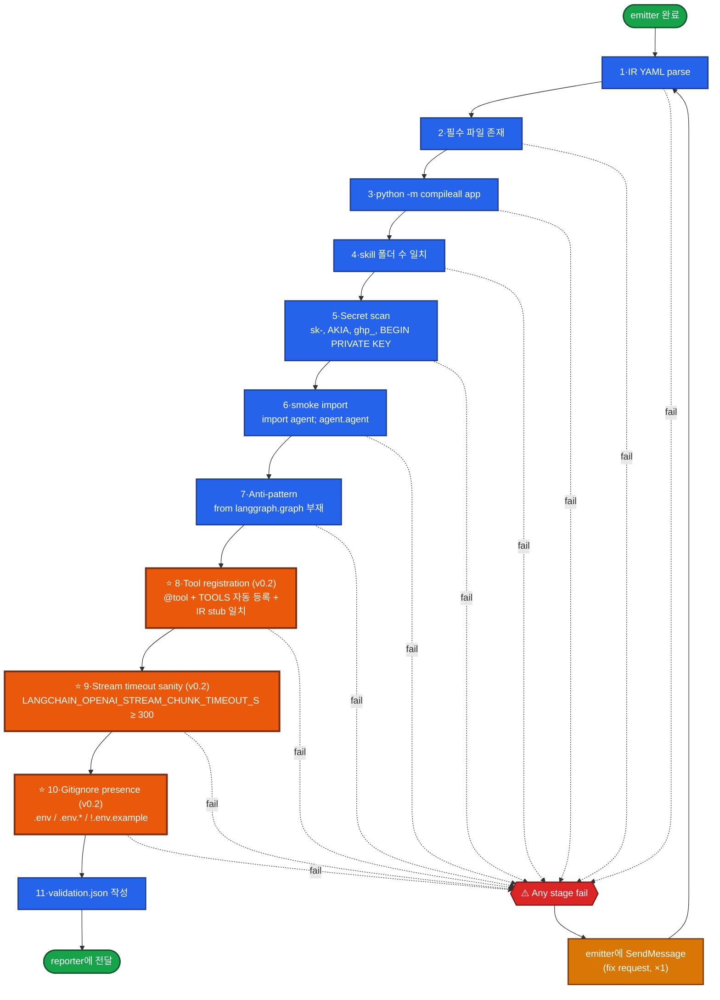
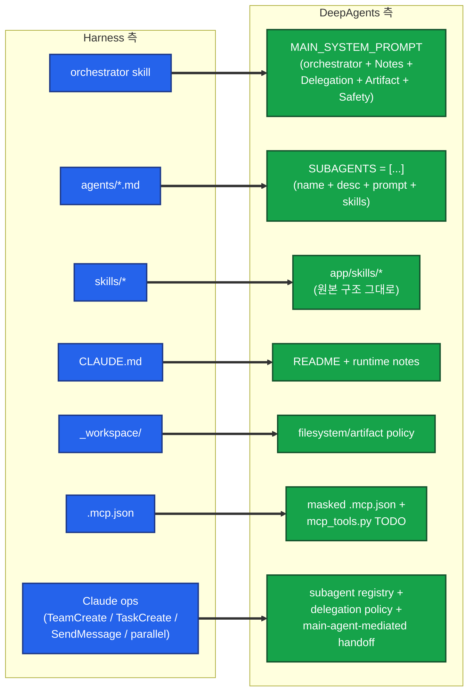
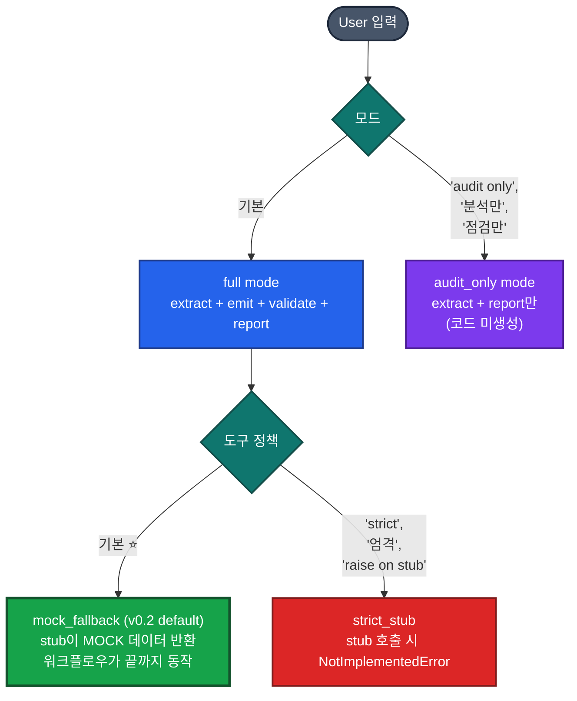

# harness2deepagents

**RevFactory `/harness`로 만든 Claude Code 에이전트 팀을, 실행 가능한 LangChain DeepAgents Python 앱으로 자동 변환하는 Claude Code 스킬.**

`/harness`가 자신의 강점인 "선언적 에이전트 팀 설계"를 책임진다면, `harness2deepagents`는 그 산출물을 받아 **즉시 `langgraph dev`로 띄울 수 있고, 기본 UI(`langchain-ai/deep-agents-ui`)까지 붙은 Python 패키지**로 바꿔준다.

- **버전:** v0.2.0
- **소스 포맷:** `.claude/agents/*.md`, `.claude/skills/*/SKILL.md`, `.mcp.json`, `CLAUDE.md`
- **타겟:** `from deepagents import create_deep_agent` 기반 Python 앱
- **기본 UI:** [`langchain-ai/deep-agents-ui`](https://github.com/langchain-ai/deep-agents-ui) (자동 wiring)
- **금지:** raw LangGraph emitter, 단일 `create_agent` 앱, secret 하드코딩

> 모든 다이어그램은 GitHub 다크/라이트 모드 모두에서 동일하게 보이는 saturated badge 컬러 시스템을 사용합니다.

---

## 한 장 요약



---

## 언제 쓰는가

| 트리거 | 동작 |
|---|---|
| `/harness2deepagents` | 현재 디렉토리에서 `.claude/`를 찾아 `ports/deepagents/`로 변환 (full 모드) |
| `/harness2deepagents audit only` | 코드 생성 없이 IR + conversion_report만 생성 |
| `/h2d` | full 모드 alias |
| "이 .claude를 DeepAgents로 변환" / "하네스 마이그레이션" / "Claude Code 팀을 LangChain으로" | 자연어 트리거 |

쓰지 말아야 할 케이스:

- "harness 만들어줘" → `/harness` (생성용, 변환 아님)
- "LangGraph로 graph 만들어줘" → out of scope (raw LangGraph는 의도적으로 거부)
- "deepagents 라이브러리 설치 방법" → 일반 질문

---

## 4-에이전트 팀 구성

`harness2deepagents`는 단일 모놀리식 변환기가 아니라 **Pipeline + Producer-Reviewer** 패턴의 4-에이전트 팀이다.



| # | 팀원 | 입력 | 출력 | 핵심 책임 |
|---|------|------|------|----------|
| 1 | **harness-extractor** | `.claude/*`, `.mcp.json`, `CLAUDE.md` | `_workspace/01_extractor_ir.yaml` | 파싱 + 패턴 추정 + secret 마스킹 |
| 2 | **deepagents-emitter** | IR YAML | `output_dir/app/*` (12개 파일) | 결정적 코드 생성, `@tool` wrap, UI wiring |
| 3 | **port-validator** | `output_dir/app/*` | `logs/validation.json` | compile/secret/smoke/anti-pattern 검증 (11 stages) |
| 4 | **conversion-reporter** | IR + validation.json | `conversion_report.md` + 품질 점수 | 운영-준비 handoff 체크리스트 |

`audit_only` 모드에서는 extractor + reporter만 동작하며 코드 방출은 차단된다.

---

## 변환 워크플로우 (7 phase)



---

## 생성되는 앱 구조



⭐ 표시(orange, 두꺼운 border)는 **v0.2부터 기본 포함**되어, 사용자가 별도 wiring 없이 deep-agents-ui를 실행할 수 있다.

---

## 기본 UI 런타임 토폴로지



**실행 순서 (생성된 앱의 README가 그대로 안내):**

```bash
cd ports/deepagents/app
python3 -m venv .venv && source .venv/bin/activate
pip install -r requirements.txt
cp .env.example .env             # provider 블록 uncomment + 키
set -a; source .env; set +a
python smoke_test.py             # import 확인

# 터미널 A — 백엔드
langgraph dev --port 2024 --no-browser
# → http://127.0.0.1:2024/ok 확인

# 터미널 B — UI (최초 1회만 bootstrap)
bash bootstrap_ui.sh
cd ui && yarn install            # Node 20+ 권장
yarn dev                         # http://localhost:3000
```

---

## Provider 매트릭스 (provider-agnostic)

`DEEPAGENTS_MODEL` 환경변수가 LangChain `init_chat_model` 형식을 따른다. **어떤 provider든 코드 변경 없이** `.env`만 바꾸면 된다.



| Provider | `DEEPAGENTS_MODEL` 예 | 필요한 env | 추가 설치 |
|---|---|---|---|
| **Anthropic** (default) | `anthropic:claude-sonnet-4-6` | `ANTHROPIC_API_KEY` | — (기본 포함) |
| **OpenAI** | `openai:gpt-4o` | `OPENAI_API_KEY` | — (기본 포함) |
| **Azure OpenAI** | `azure_openai:<deployment-name>` | `AZURE_OPENAI_API_KEY`, `AZURE_OPENAI_ENDPOINT`, `OPENAI_API_VERSION=2025-01-01-preview`, `AZURE_OPENAI_DEPLOYMENT_NAME` | — (기본 포함) |
| **AWS Bedrock** | `bedrock_converse:anthropic.claude-3-5-sonnet-...` | AWS keys + region | `pip install langchain-aws` |
| **Google Vertex** | `google_vertexai:gemini-1.5-pro` | GCP credentials | `pip install langchain-google-vertexai` |

> **Azure 주의:** `azure_openai:<deployment>` — model id가 아닌 **Azure deployment name**을 쓴다. GPT-5.x 계열은 `OPENAI_API_VERSION=2025-01-01-preview` 이상 필수.
>
> **Reasoning 모델 (gpt-5.x / o3 / claude-opus-extended-thinking) 주의:** `LANGCHAIN_OPENAI_STREAM_CHUNK_TIMEOUT_S=600` 미설정 시 `StreamChunkTimeoutError`로 중단된다. `.env.example`에 기본 추가됨.

---

## Validator 11-Stage 파이프라인 (v0.2)

`port-validator`가 emitter의 산출물을 11단계로 검증한다. 어느 한 stage라도 실패하면 emitter에게 1회 fix 요청.



⭐ 표시(orange, 두꺼운 border) stage 8/9/10은 **v0.2에서 신규 추가** — v0.1 산출물을 실제 운영했을 때 발견된 함정에 대한 회귀 방어.

---

## 매핑 규칙 (Harness → DeepAgents)



| Harness | DeepAgents | Lossiness |
|---|---|---|
| `.claude/agents/*.md` body | subagent `system_prompt` (raw string 보존) | Low |
| agent name / description | subagent `name` / `description` | Low |
| `.claude/skills/*/` 전체 트리 | `app/skills/*/` (그대로 복사) | Low |
| `TeamCreate` | `SUBAGENTS` registry | Low |
| `TaskCreate` | main agent planning 지시 | Medium |
| `SendMessage` | main-agent-mediated handoff | Medium |
| Peer-to-peer team chat | (직접 표현 불가) | **High** |
| `Agent(..., run_in_background=true)` | parallel delegation 지시 또는 TODO | Medium |

**원칙:** Who(agent) / How(skill) / When(orchestration) / What left(artifact) 4축 분리를 유지. **prompt 평탄화 금지** — 여러 agent body를 main prompt 하나로 합치지 않는다.

---

## 모드 매트릭스



**왜 `mock_fallback`이 v0.2 기본인가?** v0.1은 `raise NotImplementedError` + `TOOLS = []`가 기본이라 첫 도구 호출에서 워크플로우가 즉사했다. 데모/CI/오프라인에서 운영 가치가 없었다.

mock 모드에서도 emitter는 각 stub의 docstring에 **reference 구현 1~2개**(Z.AI / Tavily / FAL / httpx 등)를 주석으로 함께 emit하므로, 사용자가 mock → real로 갈 때 0부터 시작하지 않는다.

---

## Quick Start

### 1. Harness 산출물이 있는 디렉토리에서 호출

```bash
cd /path/to/your/harness-project   # .claude/agents, .claude/skills 가 있는 곳
# Claude Code에서:
/harness2deepagents
```

### 2. 변환이 끝나면 (≈수십 초) 다음 출력

```
✅ DeepAgents 앱 변환 완료
- 출력: ports/deepagents/
- 변환 점수: 0.92/1.00
- Manual actions: 3건
- tools_mode: mock_fallback

📋 Service-ready checklist:
1. cd ports/deepagents/app
2. python3 -m venv .venv && source .venv/bin/activate
3. pip install -r requirements.txt
4. cp .env.example .env  # provider 키 채우기
5. set -a; source .env; set +a
6. python smoke_test.py
7. langgraph dev --port 2024 --no-browser
8. (옵션) bash bootstrap_ui.sh && cd ui && yarn install && yarn dev
```

위 체크리스트가 그대로 작동한다 (v0.2 회귀 방어 덕분).

### 3. Audit-only로 변환 가능성만 점검

```bash
/harness2deepagents audit only
```

→ 코드 생성 없이 `_workspace/01_extractor_ir.yaml` + `conversion_report.md`만 산출.

---

## v0.2.0 운영 함정 카탈로그

v0.1 산출물을 LangGraph 백엔드 + deep-agents-ui 프론트엔드까지 실제로 띄워본 결과 발견된 함정들. v0.2에서 emitter/validator가 모두 **코드 생성 시점에** 자동 방지한다.

| # | 증상 | v0.1 원인 | v0.2 자동 방지 |
|---|---|---|---|
| F1 | 첫 도구 호출에서 `NotImplementedError` → 즉사 | stub `raise` + `TOOLS = []` | **mock_fallback 기본** + `TOOLS` 자동 등록 |
| F2 | LLM이 도구 자체를 인지 못 함 | plain function (args schema 노출 X) | **`@tool` 데코레이터 의무화** (Stage 8 검증) |
| F3 | `.env` 커밋 위험 | `.gitignore` 부재 | **`app/.gitignore` 자동 생성** (Stage 10 검증) |
| F4 | `StreamChunkTimeoutError: 583 chunks then 120s silence` | langchain-openai 기본 120s가 reasoning 모델에 짧음 | `.env.example`에 **`LANGCHAIN_OPENAI_STREAM_CHUNK_TIMEOUT_S=600`** (Stage 9 검증) |
| F5 | Azure GPT-5.x deployment 응답 안 함 | `OPENAI_API_VERSION=2024-10-21` 구버전 | provider notes에 **`2025-01-01-preview` 권장** |
| F6 | UI 띄우는 게 복잡 (yarn install + Node 20) | README가 `bash bootstrap_ui.sh`만 언급 | README에 **정확한 3줄 명령 시퀀스** + Node 버전 |
| F7 | recursion_limit 기본 25에서 빠르게 한도 도달 | DeepAgents plan/todo 노드가 사이클 소비 | README에 **`recursion_limit=50` 권장** |
| F8 | `langgraph dev` 실행 위치 헷갈림 | langgraph.json 위치 불명확 | README에 **`cd app && langgraph dev`** 명시 |
| F9 | `.env` 변수가 안 먹힘 | `source .env` 누락 | README에 **`set -a; source .env; set +a`** 명시 |
| F10 | `from langchain_core.tools import tool` import 누락 | requirements.txt에 langchain-core 누락 | **requirements.txt 최소에 명시** |

이 함정들은 단순한 문서화 누락이 아니라 **emitter/validator의 결함**으로 분류됐다. v0.2부터 모든 신규 산출물은 코드 생성 시점에 자동으로 방지된다.

---

## 에러 핸들링

```mermaid
flowchart TB
    classDef start fill:#475569,color:#fff,stroke:#1e293b,stroke-width:2px
    classDef check fill:#0f766e,color:#fff,stroke:#134e4a,stroke-width:2px
    classDef ok fill:#16a34a,color:#fff,stroke:#14532d,stroke-width:2px
    classDef warn fill:#d97706,color:#fff,stroke:#78350f,stroke-width:2px
    classDef fail fill:#dc2626,color:#fff,stroke:#7f1d1d,stroke-width:3px

    Start([변환 시작]):::start
    Check{".claude/agents 또는<br/>.claude/skills 존재?"}:::check
    NoSrc[["❌ 즉시 종료<br/>'RevFactory Harness 산출물 미발견'<br/>파일 생성 없음"]]:::fail
    ExtErr{extractor 부분<br/>parsing 실패?}:::check
    ExtWarn["가용 IR로 진행 +<br/>warnings 기록"]:::warn
    EmitErr{emitter 단계 실패?}:::check
    EmitRetry["1회 재시도"]:::warn
    EmitPartial["부분 산출물 보존 +<br/>reporter에 표시"]:::warn
    ValErr{validator fail<br/>(compile/secret)?}:::check
    ValFix["emitter에<br/>fix 요청 (×1)"]:::warn
    ValStill{여전히 fail?}:::check
    ValPartial["reporter에 명시"]:::warn
    Done([reporter → User]):::ok

    Start --> Check
    Check -->|"없음"| NoSrc
    Check -->|"있음"| ExtErr
    ExtErr -->|"yes"| ExtWarn
    ExtErr -->|"no"| EmitErr
    ExtWarn --> EmitErr
    EmitErr -->|"yes"| EmitRetry
    EmitErr -->|"no"| ValErr
    EmitRetry --> EmitPartial
    EmitPartial --> ValErr
    ValErr -->|"yes"| ValFix
    ValErr -->|"no"| Done
    ValFix --> ValStill
    ValStill -->|"yes"| ValPartial
    ValStill -->|"no"| Done
    ValPartial --> Done
```

| 상황 | 전략 |
|---|---|
| `.claude` 산출물 미발견 | 즉시 종료, 명확한 메시지, 파일 생성 없음 |
| extractor 부분 실패 | 가용 IR로 진행 + warnings 기록 |
| emitter 한 단계 실패 | 1회 재시도, 재실패 시 부분 산출물 보존 |
| validator fail | emitter에 fix 요청 1회 → 재검증 → 여전히 fail이면 reporter 명시 |
| 기존 `ports/deepagents/` 존재 | `ports/deepagents_YYYYMMDD_HHMMSS/` 새 폴더 (덮어쓰기 절대 금지) |
| audit_only에서 emit 트리거 시도 | 오케스트레이터가 차단 |
| 팀원 중지 | 리더가 감지 → 재시작 → 실패 시 부분 결과로 reporter |

---

## 안전 규칙 (불변)

- 🔒 **원본 `.claude/`는 읽기 전용** — 절대 수정하지 않음
- 🔒 **출력 경로는 project root 아래로 제한** — path traversal 차단
- 🔒 **Secret 마스킹** — `sk-...`, `AKIA...`, `ghp_...`, `BEGIN PRIVATE KEY` 등 패턴은 IR/code/report 어디에도 raw로 노출 안 함
- 🔒 **외부 API 호출 없음** — live invocation 금지 (smoke_test는 import만)
- 🔒 **MCP 서버 자동 실행 안 함** — `mcp_tools.py`는 TODO stub만 생성
- 🔒 **raw LangGraph emitter 생성 금지** — Stage 7 anti-pattern check에서 차단
- 🔒 **`.env` 커밋 차단** — emit 시 `.gitignore` 자동 생성

---

## 디렉토리 구조 (이 스킬 자체)

```
~/.claude/skills/harness2deepagents/
├── SKILL.md                       # 오케스트레이터 (이 스킬의 진입점)
├── README.md                      # ← 지금 이 문서
└── references/
    ├── ir-schema-summary.md       # IR YAML 스키마 요약
    ├── mapping-rules.md           # Harness ops → DeepAgents 매핑
    ├── usage-examples.md          # 호출 예시 + 트리거 패턴
    └── edge-cases.md              # EC-001~EC-010

# 같은 working tree의 보조 스킬들
~/.claude/skills/
├── harness-source-extraction/     # extractor가 사용 (.claude → IR)
├── deepagents-emission/           # emitter가 사용 (IR → app/)
│   ├── SKILL.md
│   ├── assets/                    # *.tmpl 코드 템플릿 11종
│   ├── scripts/emit_deepagents.py # 결정적 codegen 엔진
│   └── references/
│       ├── codegen-templates.md
│       ├── prompt-synthesis.md
│       ├── mcp-handling.md
│       └── tool-adapters.md       # v0.2 — provider별 reference 구현
├── port-validation/               # validator가 사용 (11-stage)
└── conversion-reporting/          # reporter가 사용

# 같은 working tree의 에이전트들
~/.claude/agents/
├── harness-extractor.md
├── deepagents-emitter.md
├── port-validator.md
└── conversion-reporter.md
```

---

## 참고 문서

| 문서 | 다루는 내용 |
|---|---|
| `SKILL.md` | 오케스트레이터 / 7-phase workflow / 운영 함정 카탈로그 |
| `references/ir-schema-summary.md` | `harness.deepagents.ir.yaml` 스키마 (PRD §12.2) |
| `references/mapping-rules.md` | Harness ↔ DeepAgents 매핑 규칙 (PRD §16) |
| `references/usage-examples.md` | 트리거 키워드 / 호출 패턴 / 실행 시퀀스 |
| `references/edge-cases.md` | EC-001 ~ EC-010 |
| `../deepagents-emission/SKILL.md` | 9-step emit 절차 / 템플릿 변수 |
| `../deepagents-emission/references/tool-adapters.md` | web_search / fetch_url / image_gen — Z.AI / Tavily / FAL 구현 모음 |
| `../port-validation/SKILL.md` | 11-stage 검증 절차 |
| `../conversion-reporting/SKILL.md` | 13-section 보고서 구조 + 품질 점수 가중치 |

---

## 한 줄 정리

> **`/harness`가 설계한 에이전트 팀을, `/harness2deepagents`가 즉시 띄울 수 있는 LangChain DeepAgents 앱으로 옮긴다 — UI 포함, provider 자유, 운영 함정 자동 방지.**
