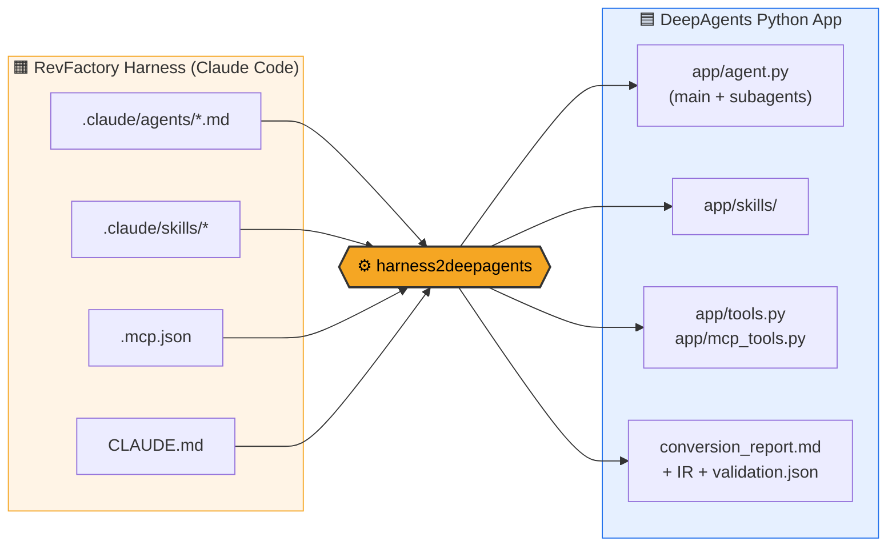
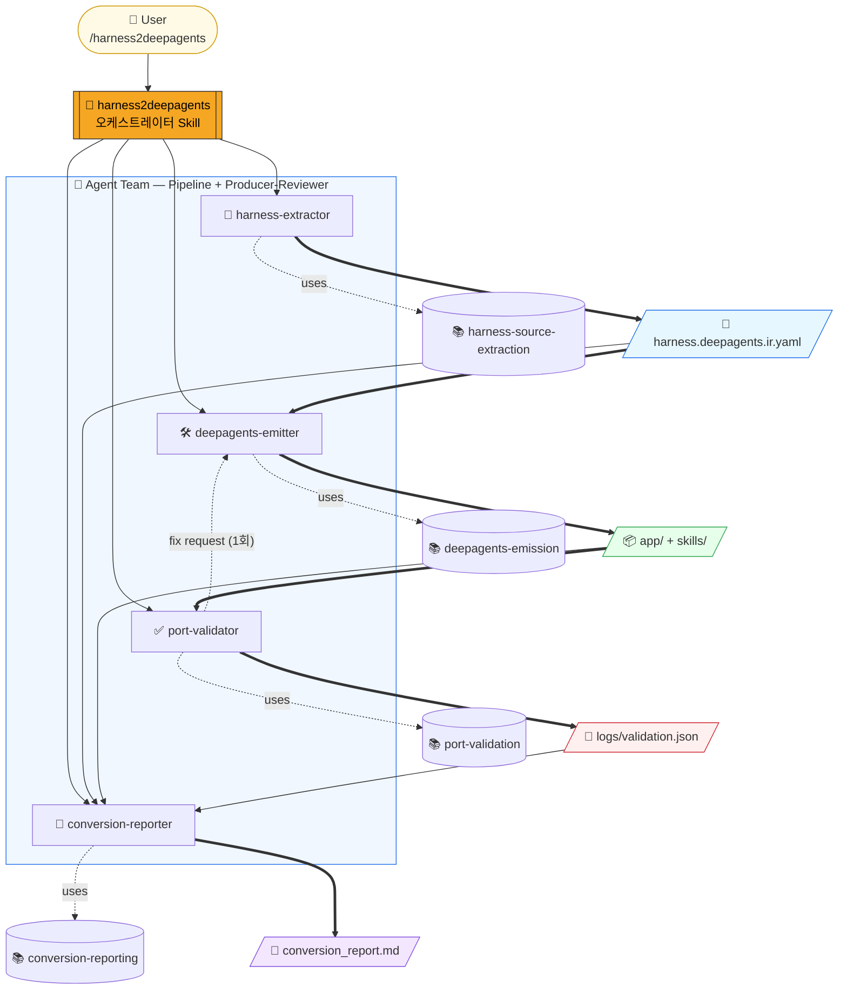
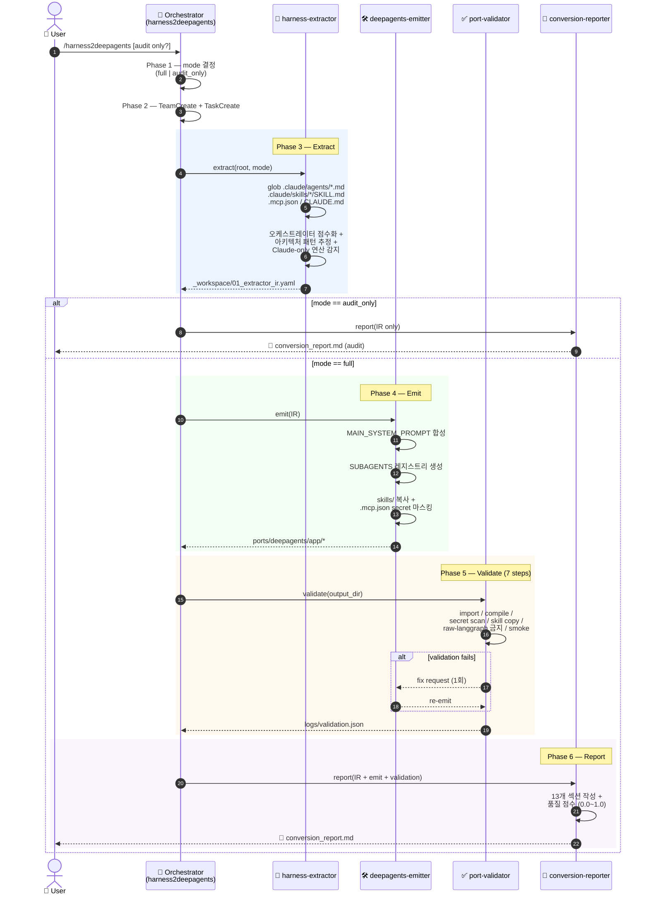
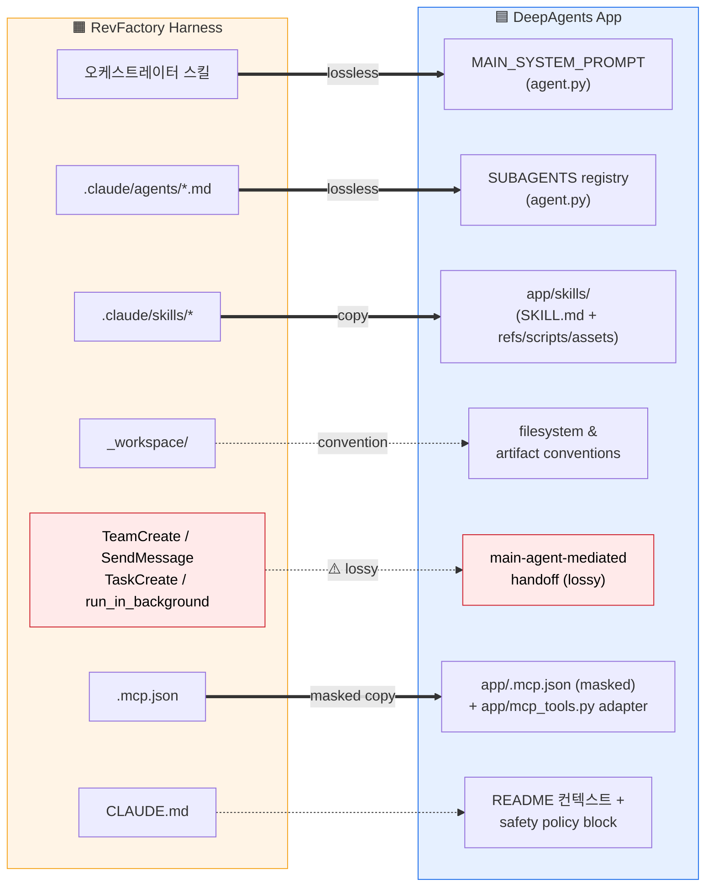
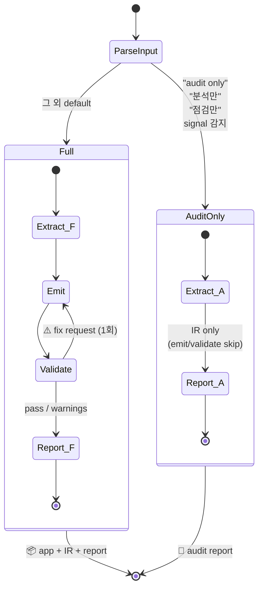
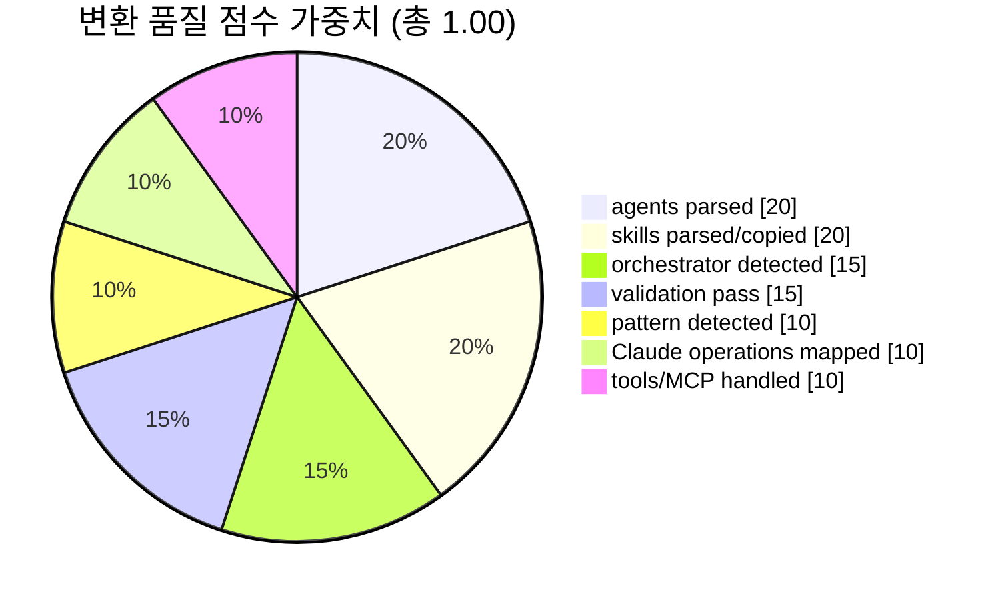

# harness2deepagents

> **RevFactory `/harness`가 만든 Claude Code 산출물을 실행 가능한 LangChain DeepAgents Python 앱으로 자동 포팅하는 Claude Code 스킬.**

[]()
[]()
[]()
[]()



---

## 왜 만들었나

RevFactory `/harness`는 Claude Code 위에서 도메인을 "전문 에이전트 + 스킬 + 오케스트레이터" 구조로 분해해 주는 강력한 팀 아키텍처 팩토리입니다. 하지만 그 산출물은 Claude Code 런타임에 강하게 묶여 있어, Python/LangChain 기반 서비스에서 그대로 실행하기 어렵습니다.

`harness2deepagents`는 그 간극을 메웁니다.

- `.claude/agents/*.md` → DeepAgents **subagents**
- `.claude/skills/*` → DeepAgents **skills 디렉터리**
- 오케스트레이터 스킬 → DeepAgents **main agent system prompt**
- `TeamCreate` / `SendMessage` 등 Claude-only 연산 → **main-agent-mediated handoff**로 근사
- `.mcp.json` → secret 마스킹된 안전 사본 + `mcp_tools.py` adapter stub

> **핵심 원칙:** raw LangGraph는 기본 생성하지 않습니다. DeepAgents 전용이며, LangGraph는 DeepAgents 내부 런타임/escape hatch로만 취급합니다.

---

## 구성

이 레포지토리는 그 자체로 Claude Code Skill 패키지입니다.

```text
harness2deepagents/
├── harness2deepagents_prd.md       # PRD v0.1 (단일 source of truth)
├── .claude/
│   ├── agents/                     # 4명의 전문 에이전트
│   │   ├── harness-extractor.md
│   │   ├── deepagents-emitter.md
│   │   ├── port-validator.md
│   │   └── conversion-reporter.md
│   └── skills/                     # 5개의 스킬
│       ├── harness2deepagents/        # ← 오케스트레이터 (사용자 진입점)
│       ├── harness-source-extraction/
│       ├── deepagents-emission/
│       ├── port-validation/
│       └── conversion-reporting/
└── README.md
```

---

## 에이전트 팀 (Pipeline + Producer-Reviewer)

4명의 전문 에이전트가 IR 기반 파이프라인으로 협업합니다.



| # | 에이전트 | 역할 | 주 스킬 | 산출물 |
|---|---|---|---|---|
| 1 | **harness-extractor** | `.claude/*` 파싱, 오케스트레이터·아키텍처 패턴·Claude-only 연산·MCP 감지 | `harness-source-extraction` | `_workspace/01_extractor_ir.yaml` |
| 2 | **deepagents-emitter** | IR → `create_deep_agent` 기반 Python 앱 코드 생성, 스킬 복사, MCP 마스킹 | `deepagents-emission` | `output_dir/app/*` |
| 3 | **port-validator** | 7단계 검증 (import / compile / secret leak / skill copy / raw-langgraph 금지 / smoke) | `port-validation` | `output_dir/logs/validation.json` |
| 4 | **conversion-reporter** | IR + validation 통합, 13개 섹션 보고서, 0.0~1.0 품질 점수 산출 | `conversion-reporting` | `output_dir/conversion_report.md` |

---

## 워크플로우 (Sequence)



---

## 5가지 핵심 원칙

1. **DeepAgents only** — raw LangGraph 또는 단일 `create_agent` 앱은 절대 생성하지 않습니다.
2. **IR 우선** — `harness.deepagents.ir.yaml`을 먼저 만든 뒤에만 codegen합니다. IR 없이 바로 `agent.py`를 쓰지 않습니다.
3. **구조 보존** — `Who(agent) / How(skill) / When(orchestration) / What(artifact)`의 4분리를 유지합니다.
4. **프롬프트 평탄화 금지** — 여러 agent와 skill을 거대 system prompt 하나로 합치지 않습니다.
5. **안전한 변환** — 기존 `ports/deepagents/` 보존(timestamp 폴백), secret 마스킹, 원본 `.claude/` 불변.

---

## 변환 매핑 (Harness → DeepAgents)



> `==>`(굵은 화살표) = lossless 변환 · `-.->`(점선) = convention/lossy 매핑

---

## 모드별 실행 흐름



---

## 사용 방법

### 1) 이 스킬을 Claude Code에 설치

```bash
git clone https://github.com/tykimos/harness2deepagents.git ~/harness2deepagents
ln -s ~/harness2deepagents/.claude/skills/harness2deepagents \
      ~/.claude/skills/harness2deepagents
ln -s ~/harness2deepagents/.claude/skills/harness-source-extraction \
      ~/.claude/skills/harness-source-extraction
ln -s ~/harness2deepagents/.claude/skills/deepagents-emission \
      ~/.claude/skills/deepagents-emission
ln -s ~/harness2deepagents/.claude/skills/port-validation \
      ~/.claude/skills/port-validation
ln -s ~/harness2deepagents/.claude/skills/conversion-reporting \
      ~/.claude/skills/conversion-reporting
```

에이전트도 마찬가지로 `~/.claude/agents/`에 심볼릭 링크하거나, 변환하려는 프로젝트의 `.claude/agents/`에 복사합니다.

### 2) Claude Code에서 호출

```text
/harness2deepagents
```

또는:

```text
/harness2deepagents audit only
이 프로젝트의 RevFactory Harness 산출물을 점검만 해줘. 코드는 생성하지 마.
```

```text
/harness2deepagents
이 프로젝트의 .claude/*를 DeepAgents로 포팅해줘. MCP 설정은 유지하고 원본은 건드리지 마.
```

### 3) 생성된 DeepAgents 앱 실행

```bash
cd ports/deepagents/app
pip install -r requirements.txt
export ANTHROPIC_API_KEY=...
python smoke_test.py        # import-level sanity check
python agent.py             # 실제 호출
```

---

## 출력 구조

```text
ports/deepagents/                     # 이미 존재 시 ports/deepagents_YYYYMMDD_HHMMSS/
├── harness.deepagents.ir.yaml         # 변환 중간 표현 (IR)
├── conversion_report.md               # 13개 섹션 보고서 + 품질 점수
├── app/
│   ├── agent.py                       # create_deep_agent + MAIN_SYSTEM_PROMPT + SUBAGENTS
│   ├── config.py                      # 모델 env var
│   ├── tools.py                       # local tool stubs
│   ├── mcp_tools.py                   # MCP adapter TODO (감지 시)
│   ├── smoke_test.py                  # import 테스트
│   ├── requirements.txt
│   ├── pyproject.toml
│   ├── README.md
│   ├── skills/                        # .claude/skills/* 복사본
│   └── .mcp.json                      # secret 마스킹된 사본
└── logs/
    └── validation.json
```

---

## 변환 품질 점수

`conversion-reporter`가 가중평균으로 산출합니다.



| 항목 | 가중치 |
|---|---:|
| agents parsed | 0.20 |
| skills parsed/copied | 0.20 |
| orchestrator detected | 0.15 |
| pattern detected | 0.10 |
| Claude operations mapped | 0.10 |
| tools/MCP handled | 0.10 |
| validation pass | 0.15 |

| 점수 | 해석 |
|---|---|
| 0.90 ~ 1.00 | 거의 바로 실행 가능 |
| 0.75 ~ 0.89 | 소규모 수동 수정 필요 |
| 0.50 ~ 0.74 | 구조 보존됨, tool/prompt 수정 필요 |
| 0.00 ~ 0.49 | 감사용 산출물 (실행 보장 안 됨) |

---

## 비목표 (Non-goals)

- Raw LangGraph 코드 기본 생성
- LangChain `create_agent` 단일 에이전트 앱 생성
- `TeamCreate` / `TaskCreate` / `SendMessage`의 완벽 재현
- 모든 MCP 서버의 자동 LangChain tool 구현
- API key / token / secret의 코드 하드코딩
- 원본 `.claude/` 파일 수정
- 외부 서비스 자동 배포

---

## 지원하는 아키텍처 패턴 감지

- `pipeline`
- `fanout_fanin`
- `expert_pool`
- `producer_reviewer`
- `supervisor`
- `hierarchical`
- `hybrid`

각 패턴은 confidence(0.0~1.0)와 evidence(증거 문자열 리스트)와 함께 IR에 기록됩니다.

---

## 안전성

- **Secret 절대 하드코딩 금지** — `.mcp.json` 내 secret-like literal은 `"***REDACTED***"`로 마스킹
- **원본 불변** — `.claude/agents`, `.claude/skills`는 절대 수정하지 않음
- **덮어쓰기 방지** — 기존 `ports/deepagents/`가 있으면 timestamp 폴더로 자동 폴백
- **Path traversal 차단** — output path가 project root 밖이면 에러
- **Live invocation 금지** — `port-validator`는 import/compile/smoke 정적 검증만 수행, 실제 모델 호출 안 함

### Port Validator — 7단계 검증 파이프라인

```mermaid
flowchart LR
    Start([📦 emit 완료]) --> S1
    S1["1️⃣ import test<br/>(deepagents)"] --> S2
    S2["2️⃣ python compile<br/>(compileall app)"] --> S3
    S3["3️⃣ secret leak scan<br/>(regex + entropy)"] --> S4
    S4["4️⃣ skill copy 완전성<br/>(SKILL.md + refs/scripts/assets)"] --> S5
    S5["5️⃣ raw-langgraph<br/>금지 패턴 검사"] --> S6
    S6["6️⃣ smoke test<br/>(no model call)"] --> S7
    S7["7️⃣ IR ↔ output<br/>일관성 체크"] --> Decide{종합 판정}

    Decide -->|pass| OK([✅ logs/validation.json<br/>status: pass])
    Decide -->|warnings| WARN([⚠️ pass_with_warnings])
    Decide -->|fail| FIX[🔁 emitter에 fix 요청<br/>(1회)]
    FIX --> S1

    style Start fill:#fffae6,stroke:#d4a017
    style OK fill:#e6ffea,stroke:#2da44e
    style WARN fill:#fff4d6,stroke:#bf8700
    style FIX fill:#ffeaea,stroke:#cf222e
    style Decide fill:#f0f7ff,stroke:#1f6feb
```

---

## 문서

- [`harness2deepagents_prd.md`](./harness2deepagents_prd.md) — Draft v0.1. 모든 FR/NFR, IR 스키마, codegen 템플릿 명세 포함
- [`.claude/skills/harness2deepagents/SKILL.md`](./.claude/skills/harness2deepagents/SKILL.md) — 오케스트레이터 스킬 (사용자 진입점)
- 각 sub-skill 디렉터리의 `SKILL.md`, `references/`, `scripts/`, `assets/`

---

## 상태

- **버전:** 0.1.0 (Draft)
- **PRD 작성일:** 2026-05-06
- **타깃 Python:** 3.11+
- **타깃 DeepAgents:** `deepagents>=0.1.0`

---

## License

별도 명시가 없으면 MIT 라이선스를 권장합니다. (필요 시 `LICENSE` 파일을 추가하세요.)

---

## Acknowledgements

- [RevFactory `/harness`](https://github.com/) — 소스 런타임 (Claude Code agent team factory)
- [LangChain DeepAgents](https://github.com/langchain-ai/deepagents) — 타깃 런타임
- [Anthropic Claude Code](https://claude.com/claude-code) — 실행 환경
